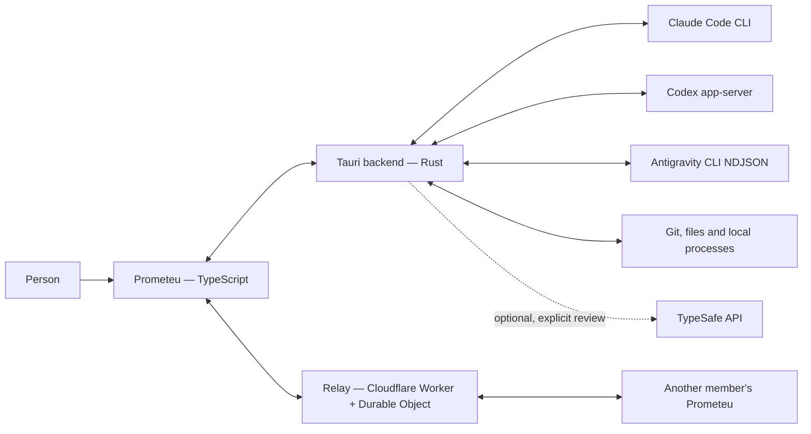

# Prometeu architecture

This document is the map of the current system. Protocol details live in
`docs/contracts/`; accepted ADRs describe decisions still in force. Proposals
declare their status separately; replaced decisions remain in Git history.

## System goal

Prometeu is a desktop app that organizes agent sessions per workspace.
Each workspace can have an isolated worktree, several conversation tabs,
supporting terminals and live sharing with a team.

The app does not implement a model. It runs CLIs installed on the machine,
translates their protocols and presents the work as an ordinary conversation.

## Context



The agent process and the workspace files have the local user's permissions.
The worktree separates Git changes, but it is not a sandbox. Shared content
uses E2EE v4; the relay receives ciphertext and routing metadata. The initial
identity is accepted by the server directory (TOFU). See
[limits](docs/decisions/0022-end-to-end-encryption.md).

## Containers and responsibilities

| Container | Technology | Responsibility | Must not own |
| --- | --- | --- | --- |
| Frontend | TypeScript + Vite | interaction, presentation, timeline, ephemeral UI state | process lifecycle and filesystem rules |
| Backend | Rust + Tauri | persisted state, processes, Git, files, IPC and agent translation | visual rules and interface translation |
| Claude adapter | `claude.rs` | convert V1 commands to stream-json and stream-json to V1 events | DOM, board state or relay |
| Antigravity adapter | `antigravity.rs` | convert native NDJSON to V1; resume native history | DOM, board state or relay |
| Codex adapter | `codex.rs` | convert V1 commands to JSON-RPC and JSON-RPC to V1 events | DOM, board state or relay |
| Relay | Worker + Durable Object | enrollment, presence, audience, comments and forwarding | agent execution or worktree access |
| Web mock | `src/mock.ts` | answer the same IPC for UI development and E2E | replace the Rust backend tests |
| Prometeu Cloud (separate project) | Rails 8.1 + SQLite + ERB | optional account, organizations, invitations and tool catalogs | agent execution, general files, secrets or transcripts |

## Current main flow

The conversation uses a contract owned by Prometeu:

```text
Claude stream-json ─> claude.rs ───────────┐
                                           ├─> ConversationEventV1 ─> Pump/relay ─> timeline.ts ─> chat.ts
Codex JSON-RPC ─> codex.rs ────────────────┤
Antigravity ────> antigravity.rs ───────────────┘
```

`chat.rs` stores and numbers V1 lines, emits updates and keeps the process
alive. `timeline.ts` validates and reduces those lines into DOM-independent
items. `chat.ts` renders the items and sends `ConversationCommandV1`. Older
transcripts are adapted before the reducer, without rewriting.

The canonical protocol is the decision accepted in ADR 0002. The typed catalog
and the capabilities from ADR 0003 are implemented as well.

See [`docs/architecture/conversation-flow.md`](docs/architecture/conversation-flow.md).

## Shared interface

The shared interface comes from `packages/design-system`: distributable DOM
components, behavior, styles, TypeScript types and a Rails adapter.
`src/ui.ts` and `src/menu.ts` re-export the package; `src/ui-tokens.css` keeps
the desktop geometry. The Cloud uses the FormBuilder, the helpers and the
runtime from the same package. See the
[Design System](docs/architecture/design-system.md) for adoption, gallery and
dependency rules. Settings / Resources also exposes a data-and-callback view in
`src/components/resource-view.ts`, shared by the desktop and its isolated gallery. Resources and Actions compose reusable headers, rows, toolbars, menus and
feedback from `src/components/compositions.ts`. Chat and Git also consume
components under `src/components/`, whose manifest links APIs, stories and real
callers. The gallery presents these same components through addressable states.
Chat retains transport and drafts; Git retains operations and review storage.
The diff reader owns caches and viewport observation per instance. Hub operations
stay in their existing owners. See the
[presentation contract](docs/contracts/desktop-presentation.md).

## Optional account

The optional account appears at the top of the sidebar. The `cloud.rs` backend
connects the Mac through the browser and stores the credential privately. The
separate `prometeu-cloud` project offers account management, organizations,
email invitations and catalogs; the desktop merges shared definitions with
private items. See the [catalog contract](docs/contracts/cloud-catalog.md).
Publication is a separate operational step. See the
[contract](docs/contracts/cloud-account.md) and
[ADR 0015](docs/decisions/0015-cloud-rails.md).

## Optional context evaluation

`evaluation.rs` defines an application-owned port for bounded, closed-question
classification; `typesafe.rs` is its only adapter and keeps the person's own
API key in a private file. The integration starts disabled and runs only on an
explicit **Review request** in the launcher, whose rules live in
`src/context-review.ts`. It is independent of the agent provider, the Cloud
account, the timeline and the relay. See the
[contract](docs/contracts/context-evaluation.md) and
[ADR 0058](docs/decisions/0058-optional-context-evaluation.md).

## Local delegation

The built-in `prometeu` MCP is available without default activation.
`embedded_mcp.rs` bridges stdio to the open desktop through a private Unix
socket; `mcp_access.rs` authenticates clients and scopes projects; `delegation.rs`
authorizes only agents created by that client. Internal conversations and external
local MCP hosts use the same tools. Conversation context is optional; registered
external clients remain usable across desktop restarts. Each delegation starts with its own workspace and conversation;
execution IDs are separate. See the [contract](docs/contracts/embedded-mcp.md)
and [ADR 0049](docs/decisions/0049-embedded-delegation-mcp.md).

## Reusable actions

`actions.rs` keeps commands, profiles and runs on top of existing sessions.
`actions.ts` resolves chat/menu entries; `action-settings.ts` edits the
registry. The backend queries GitHub without calling models while waiting and
resumes the session when there is news. See the
[contract](docs/contracts/actions.md) and
[ADR 0009](docs/decisions/0009-reusable-actions.md).

## State and persistence

- `src-tauri/src/state.rs` owns the persisted board: projects, workspaces,
  tabs, choices and metadata.
- The logical session is the transcript. The process is disposable and can be
  resumed.
- Claude writes its own transcript; Prometeu writes the translated Codex and Antigravity lines
  in `~/.prometeu/chats/`.
- Agent accounts and the global selection live in `<root>/accounts.json`;
  `accounts.rs` coordinates the local profiles and the adapters run the
  official login.
- Team state lives in `~/.prometeu/team.json`, with private permissions.
- Private identities, TOFU and receipts live in `team-security.json`;
  `team-channel.ts` is the encrypted-content boundary of the webview.
- The relay persists only the data needed for collaboration and offline members.

Formats and compatibility are in
[`docs/contracts/persistence.md`](docs/contracts/persistence.md).

## Local telemetry

`telemetry.rs` owns the private local SQLite event store. Provider adapters
normalize usage; accepted conversation input, live output, workspace use cases
and PR discovery capture typed content-free facts. The store persists independent
of transcript or board retention. Concrete queries reach the settings summary
through typed IPC, with JSONL export and complete history deletion.

A per-process capture gate preserves input/output order while commits run outside
board, transcript and chat locks. Missing ends and ambiguous streaming-input
attribution remain incomplete; telemetry failure never rejects agent commands.
The first version has no Cloud synchronization or analytics upload. See the
[contract](docs/contracts/telemetry.md) and
[ADR 0059](docs/decisions/0059-local-telemetry-foundation.md).

## Internal public boundaries

Three contracts require explicit compatibility:

1. Frontend ↔ Rust: IPC commands and Tauri events.
2. Backend ↔ agent process: stream-json and JSON-RPC adapters to V1.
3. App ↔ relay: the `PROTO = 4` protocol, JSON text and binary frames.

The third already has a single typed and validated source in
`relay/src/protocol.ts`. The first uses the command map in `src/ipc.ts` to
check names, arguments, and results in both callers and the browser mock.
Rust handler names have a parity test; argument/result bindings are still
maintained manually. See [ADR 0024](docs/decisions/0024-typed-ipc.md).
The second uses the V1 contracts typed in the frontend. `claude.rs` adapts
Claude's stream-json and `codex.rs` adapts Codex's JSON-RPC directly; both
depend on the canonical primitives in `conversation.rs`.

## Architectural rules

- JSON-RPC and stream-json payloads end at the adapters; the timeline consumes
  only validated V1 events.
- Persisted state changes in the backend and is published to the frontend.
- Pure rules must stay testable without DOM, Tauri or network.
- Application use cases receive the state and effects they need. The workspace
  tool-selection use case in `workspace_tools.rs` is tested without a Tauri
  application; its commands own error translation and board publication. Saving
  a selection leaves existing processes intact and applies at the next spawn
  or resume of a stopped process.
- The frontend does not access the filesystem or processes directly; it uses IPC.
- The relay validates every input and enforces the audience on the server; the
  client also authenticates content and enforces the audience, without trusting
  `watch` as authorization.
- Transcript and board compatibility take precedence over cosmetic cleanup.
- Support differences visible in the UI use `AgentCapabilities`; dispatch by
  `ProviderId` stays in the catalog or in the adapters.
  `npm run architecture:check` protects that boundary on the main screens and
  prevents the Codex adapter from emitting legacy stream-json again.
- Runtime TypeScript imports must remain acyclic. Portable boundaries are
  checked through intermediate modules as well as direct imports. Feature
  coordination belongs in composition callbacks, as in settings' skill refresh
  and the issues feature's Linear connection input.
- The MCP/plugin hub is shared; files, flags, marketplace, configuration home,
  activation and trust required by a given CLI are materialized only in that
  provider's adapter.

The detailed rules and the current state of each one are in
[`docs/architecture/dependency-rules.md`](docs/architecture/dependency-rules.md).

## Code map

| Area | Main entry points |
| --- | --- |
| UI boot and coordination | `src/main.ts`, `src/workspace.ts`, `src/session.ts` |
| conversation | `src/chat.ts`, `src/timeline.ts`, `src/chat-presentation.ts`, `src/desk.ts` |
| agents | `src/agents.ts`, `src/launcher.ts`, `src-tauri/src/agents.rs`, `src-tauri/src/claude.rs`, `src-tauri/src/codex.rs` |
| starting from a skill | `src/kickoff.ts`, `src/launcher.ts`, `src-tauri/src/kickoff.rs`, `[method]` in `src-tauri/src/scripts.rs`; see [ADR 0057](docs/decisions/0057-skill-kickoff-and-artifact-path.md) |
| workspaces | `src-tauri/src/session.rs`, `src-tauri/src/state.rs` |
| workspace tool selection | `src-tauri/src/workspace_tools.rs` (use case), `src-tauri/src/session.rs` (Tauri commands) |
| Git and files | `src/workspace-changes.ts`, `src/changes-menu.ts`, `src/file-menu.ts`, `src/diff.ts`, `src/viewer.ts`, `src/find.ts`, `src/quick-open.ts`, `src/csv.ts`, `src-tauri/src/session/find.rs`, `src-tauri/src/session/git.rs`, `src-tauri/src/session/diff.rs`, `src-tauri/src/session/files.rs` |
| MCP and plugins | `src/mcp.ts`, `src/plugins.ts`, `src-tauri/src/mcp.rs`, `src-tauri/src/plugins.rs`, `docs/contracts/plugin-marketplace.md` |
| collaboration | shells `src/team.ts` (desktop) and `src/mobile/` (browser, bundle for the Cloud); core `src/team-member.ts`, `src/team-ports.ts`, features `src/team-owner.ts`, `src/team-viewer.ts`, `src/team-comments.ts`; `src/team-transport.ts`, `src/team-control.ts`, `relay/src/` |
| optional context evaluation | `src-tauri/src/evaluation.rs` (port), `src-tauri/src/typesafe.rs` (adapter, key), `src/context-review.ts`, `src/context-review-view.ts`, `src/typesafe.ts`, `src/typesafe-settings.ts` |
| terminal and preview | `src/dock*.ts`, `src/term.ts`, `src/browser.ts`, `src-tauri/src/dock.rs`, `src-tauri/src/pty.rs` |

The preview shares the center with the conversation. Inspection and capture
stay at the edge of the native webview, with validated return values and an
explicit send to the draft. See the
[browser contract](docs/contracts/browser.md).

## Known pressures

- `session.rs`, `chat.ts`, `codex.rs`, `workspace.ts` and `chat.rs` concentrate
  several use cases and should be split by responsibility when a functional
  change offers a safe boundary.
- The provider identity is still called `agent` in the persisted format and in
  some payloads for compatibility, even though the type is already `ProviderId`.
- IPC types and conversation events can still diverge between Rust and TS.
- The extracted workspace tool use case still shares board types with
  `state.rs`; separating that module's persistence and publication remains a
  prerequisite for a standalone backend package.

These points do not authorize a mass reorganization. The accepted sequence is:
document, introduce tested contracts and only then move implementations.

Organizations authorize relay access through single-use tickets. The desktop
selects the organization; sharing consent is bound to the enrollment.
See the [contract](docs/contracts/cloud-organizations.md) and
[ADR 0021](docs/decisions/0021-cloud-organizations.md).

## Public issues and private feedback

The shared widget links to a new public issue in `prometeucorp/prometeu` without
copying the draft or capture. It also receives private text and images by
explicit choice. The Cloud forwards text and images to the private issue in
`prometeucorp/prometeu-cloud`, with no GitHub credentials in the client. SQLite
stores only delivery receipts, without content. Access to text and attachments
belongs to GitHub. Private delivery does not take part in E2EE sharing.
See the [contract and limits](docs/contracts/feedback.md).

Antigravity uses the same conversation boundary with native streaming NDJSON.
It references the account already connected in agy; no isolated Google profile
or API-key entry is offered. Native sessions and V1 presentation logs have
separate responsibilities. Retired Gemini boards remain readable but cannot
run; see [ADR 0052](docs/decisions/0052-antigravity-runtime.md).
