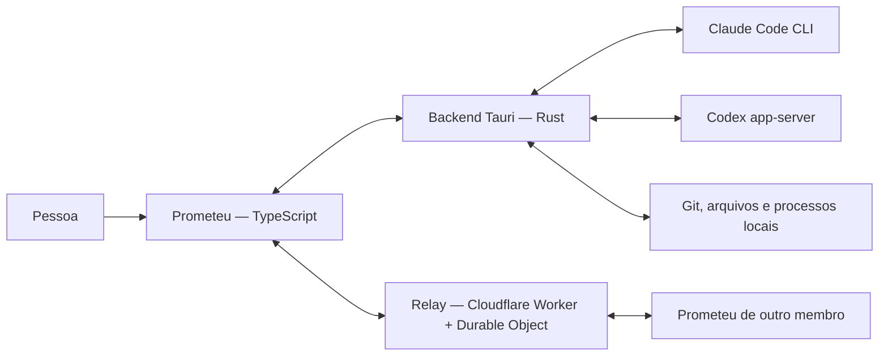

# Arquitetura do Prometeu

Este documento é o mapa do sistema atual. Detalhes de protocolo ficam em
`docs/contracts/`; decisões futuras aparecem como ADRs com status explícito.

## Objetivo do sistema

O Prometeu é um app desktop que organiza sessões de agentes por workspace.
Cada workspace pode ter um worktree isolado, várias abas de conversa, terminais
de apoio e compartilhamento ao vivo com um time.

O app não implementa um modelo. Ele executa CLIs instalados na máquina, traduz
seus protocolos e apresenta o trabalho como uma conversa comum.

## Contexto



O processo do agente e os arquivos do workspace têm as permissões do usuário
local. O worktree separa alterações Git, mas não é sandbox. O relay recebe
conteúdo compartilhado em texto legível pelo operador.

## Containers e responsabilidades

| Container | Tecnologia | Responsabilidade | Não deve possuir |
| --- | --- | --- | --- |
| Frontend | TypeScript + Vite | interação, apresentação, timeline, estado efêmero de UI | lifecycle de processos e regras de filesystem |
| Backend | Rust + Tauri | estado persistido, processos, Git, arquivos, IPC e tradução de agentes | regras visuais e tradução de interface |
| Claude adapter | `claude.rs` | converter comandos V1 para stream-json e stream-json para eventos V1 | DOM, estado do quadro ou relay |
| Codex adapter | `codex.rs` | converter comandos V1 para JSON-RPC e JSON-RPC para eventos V1 | DOM, estado do quadro ou relay |
| Relay | Worker + Durable Object | matrícula, presença, audiência, notas e encaminhamento | execução do agente ou acesso ao worktree |
| Mock web | `src/mock.ts` | responder ao mesmo IPC para desenvolvimento e E2E da UI | substituir testes do backend Rust |

## Fluxo principal atual

A conversa usa um contrato pertencente ao Prometeu:

```text
Claude stream-json ─> claude.rs ───────────┐
                                           ├─> ConversationEventV1 ─> Pump/relay ─> timeline.ts ─> chat.ts
Codex JSON-RPC ─> codex.rs ────────────────┘
```

`chat.rs` guarda e numera linhas V1, emite atualizações e mantém o processo
vivo. `timeline.ts` valida e reduz essas linhas para itens independentes de DOM.
`chat.ts` renderiza os itens e envia `ConversationCommandV1`. Transcripts
antigos são adaptados antes do reducer, sem reescrita.

O protocolo canônico é a decisão aceita no ADR 0002. O catálogo tipado e as
capabilities do ADR 0003 também estão implementados.

Veja [`docs/architecture/conversation-flow.md`](docs/architecture/conversation-flow.md).

## Estado e persistência

- `src-tauri/src/state.rs` possui o quadro persistido: projetos, workspaces,
  abas, escolhas e metadados.
- A sessão lógica é o transcript. O processo é descartável e pode ser retomado.
- Claude grava seu próprio transcript; o Prometeu grava as linhas traduzidas
  do Codex em `~/.prometeu/chats/`.
- O estado do time fica em `~/.prometeu/team.json`, com permissão privada.
- O relay persiste apenas dados necessários para colaboração e membros offline.

Formatos e compatibilidade estão em
[`docs/contracts/persistence.md`](docs/contracts/persistence.md).

## Fronteiras públicas internas

Há três contratos que exigem compatibilidade explícita:

1. Frontend ↔ Rust: comandos IPC e eventos Tauri.
2. Backend ↔ processo do agente: adapters de stream-json e JSON-RPC para o V1.
3. App ↔ relay: protocolo `PROTO = 3`, texto JSON e frames binários.

O terceiro já possui uma fonte única tipada e validada em
`relay/src/protocol.ts`. O primeiro tipa nomes de comandos, mas ainda não gera
tipos de argumentos e respostas. O segundo usa os contratos V1 tipados no
frontend. `claude.rs` adapta o stream-json do Claude e `codex.rs` adapta
diretamente o JSON-RPC do Codex; ambos dependem das primitivas canônicas de
`conversation.rs`.

## Regras arquiteturais

- Payloads de JSON-RPC e stream-json terminam nos adapters; a timeline só
  consome eventos V1 validados.
- Estado persistido muda no backend e é publicado para o frontend.
- Regras puras devem permanecer testáveis sem DOM, Tauri ou rede.
- O frontend não acessa filesystem ou processo diretamente; usa IPC.
- O relay valida toda entrada e aplica audiência no servidor.
- Compatibilidade de transcript e board tem precedência sobre limpeza estética.
- Diferenças de suporte visíveis na UI usam `AgentCapabilities`; dispatch por
  `ProviderId` fica no catálogo ou nos adapters. `npm run architecture:check`
  protege essa fronteira nas telas principais e impede que o adapter Codex
  volte a emitir stream-json legado.
- O hub de MCP/plugins é comum; arquivos, flags, marketplace, home de
  configuração, ativação e confiança exigidos por um CLI são materializados
  somente no adapter daquele provider.

As regras detalhadas e o estado atual de cada uma estão em
[`docs/architecture/dependency-rules.md`](docs/architecture/dependency-rules.md).

## Mapa do código

| Área | Entradas principais |
| --- | --- |
| boot e coordenação da UI | `src/main.ts`, `src/workspace.ts`, `src/session.ts` |
| conversa | `src/chat.ts`, `src/timeline.ts`, `src/chat-presentation.ts` |
| agentes | `src/agents.ts`, `src/launcher.ts`, `src-tauri/src/agents.rs`, `src-tauri/src/claude.rs`, `src-tauri/src/codex.rs` |
| workspaces | `src-tauri/src/session.rs`, `src-tauri/src/state.rs` |
| Git e arquivos | `src/viewer.ts`, `src/csv.ts`, `src-tauri/src/session/diff.rs`, `src-tauri/src/session/files.rs` |
| MCP e plugins | `src/mcp.ts`, `src/plugins.ts`, `src-tauri/src/mcp.rs`, `src-tauri/src/plugins.rs`, `docs/contracts/plugin-marketplace.md` |
| colaboração | `src/team.ts`, `src/team-transport.ts`, `src/team-control.ts`, `relay/src/` |
| terminal e preview | `src/dock*.ts`, `src/term.ts`, `src/browser.ts`, `src-tauri/src/dock.rs`, `src-tauri/src/pty.rs` |

## Pressões conhecidas

- `session.rs`, `chat.ts`, `codex.rs`, `workspace.ts` e `chat.rs` concentram
  múltiplos casos de uso e devem ser divididos por responsabilidade quando uma
  mudança funcional oferecer uma fronteira segura.
- A identidade do provider ainda se chama `agent` no formato persistido e em
  alguns payloads por compatibilidade, embora o tipo já seja `ProviderId`.
- Tipos de IPC e eventos de conversa ainda podem divergir entre Rust e TS.

Esses pontos não autorizam uma reorganização em massa. A sequência aceita é:
documentar, introduzir contratos testados e só então mover implementações.
