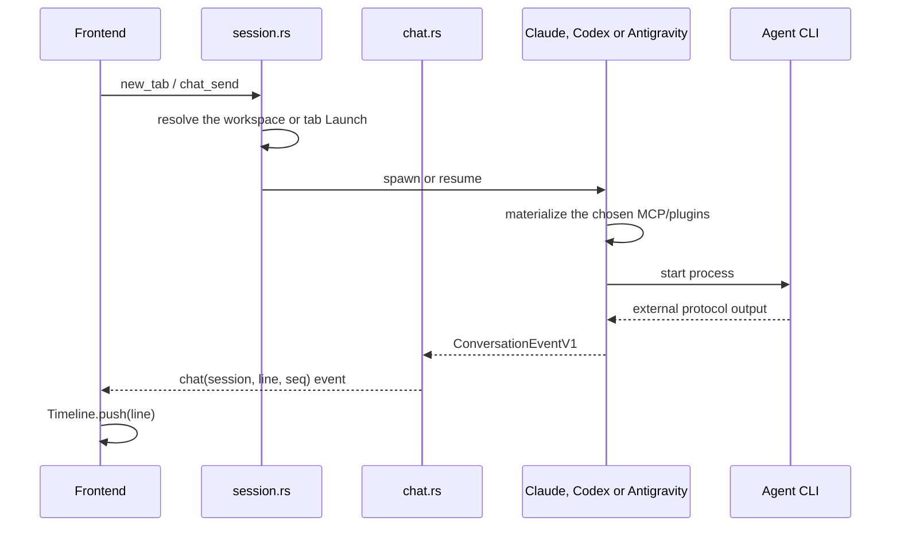

# Conversation flow

Status: current architecture.

## Core concept

A tab represents a logical session. The identity and the transcript outlive
the process that runs the agent. Closing, archiving or losing the process does
not erase the conversation; the next message can resume it.

## Start and resume

`Launch` gathers agent, model, effort, plan mode, MCP, plugins and skills. A tab
can override the workspace's agent/model/effort. Ordinary tabs resolve tools
from the global, trusted project and workspace layers for their effective
provider. [Tasks](../contracts/actions.md) keep a resolved copy of the profile,
including tools, instructions and permissions.

Materialization belongs to the edge. Claude receives MCP and plugins through
its own files and flags; Codex receives the MCP table through an override and
plugins through a derived marketplace inside a configuration `CODEX_HOME`
isolated per workspace. The account comes from the provider's global selection,
captured by the process; sessions and the plugin cache remain shared. The
configuration layer distinguishes workspace and account without writing the
selection into the global `config.toml`. If an explicit selection cannot be
prepared, or if a plugin's declared hooks cannot be activated before
`SessionStart`, the conversation does not open silently without it. The full
marketplace flow is in
[`plugin-marketplace.md`](../contracts/plugin-marketplace.md).

Switching accounts does not interrupt the current turn. The next message
resumes the process with the selected account; messages received during the
transition are queued. Plugin history and configuration stay available. The
contract is in [`accounts.md`](../contracts/accounts.md).

Switching models within the same CLI kills the process and preserves the
session. Switching from Claude to Codex or vice versa requires another tab,
since their resume mechanisms do not share an identity.

Workspace MCP/plugin/skill changes go through `workspace_tools.rs`. It validates
the selection and changes only the requested workspace axis, preserving every
tab and existing process. Saving during a turn is allowed; changes apply at the
next spawn or resume of a stopped process, not on the next message to an idle
process. `session.rs` keeps native argument handling, error translation and
board publication. Validation and state updates are tested without a Tauri
application.

## Agent output

### Claude

`claude.rs` starts `claude -p`, converts `ConversationCommandV1` into its
`stream-json` input and normalizes each output line into
`ConversationEventV1`. The process also writes Claude Code's native transcript,
which the compatibility reader adapts during replay.

### Antigravity

`antigravity.rs` converts native agy NDJSON directly to V1. It retains the
conversation ID for explicit resume and uses the existing external account.
There is no ACP handshake or replay barrier; presentation replays only its V1
log. Interactive approvals and plan transitions are unavailable. SIGINT targets
the process group; process loss is followed by native conversation resume.

### Codex

`codex.rs` starts `codex app-server`, talks over JSON-RPC and converts each
response, request or notification directly into `ConversationEventV1`. In the
opposite direction, it receives `ConversationCommandV1` and builds the matching
JSON-RPC request without going through Claude's stream-json format. Prometeu
writes the V1 events in its own transcript.

### Common path

`Pump.feed` validates JSON, records the line, assigns its transport sequence,
and emits `chat` while holding the conversation's `Lines` mutex. Snapshots
use that same mutex, so transcript and live delivery agree on order.

Sending a command holds this mutex across the child write and recording of
local user/echo events. A successful send records those events before a fast
child response can acquire the mutex. A failed write records no user event,
allowing the pending message to be retried. Independent stdout/stderr readers
continue draining into channels while command writes hold publication locks,
preventing pipe backpressure from deadlocking the child. Queued lines drain
before the existing EOF cleanup; prolonged stalls can grow queue memory.
State reactions run after releasing
the conversation locks, except the in-memory delegation execution projection:
it records canonical order under the buffer lock and publishes afterward.
See [embedded MCP](../contracts/embedded-mcp.md) for lock ordering. See [ADR 0023](../decisions/0023-ordered-publication.md)
and concurrency tests in `src-tauri/src/chat.rs`.

The `Timeline` reducer turns V1 events into user items, assistant messages,
tool blocks, requests, results, context and warnings. It is pure: it does not
touch DOM, Tauri, disk, network or provider protocols. Legacy lines go through
`conversation-legacy.ts` before the reducer. Its `busy` is the main turn;
`working` adds the background tasks, and the conversation screen uses `working`
for the Stop button and the busy composer so the person can still interrupt
children that outlived the turn.

`ChatView` still reduces every live line in order and coalesces visible painting
to an animation frame. A text-only update repaints its current message without
rebuilding the composer or comment pins; working and compaction transitions
refresh the composer, while piece additions and replacements refresh pins. When
the native window is hidden or minimized, live lines continue to update the
timeline but defer transcript painting. A visible window without focus, such as
one on a second monitor or in split view, keeps painting so the person can
follow the response. A context event that shows the window again reconciles the
buffered dirty pieces once, or renders a snapshot that arrived while hidden.
If native context is unavailable, rendering remains active. Stable piece keys
continue to preserve selection, expanded cards and comment anchors.

Native subagents outlive the turn that started them, so a conversation settles
only when the turn has ended *and* `background.changed` reports no task.
`chat.rs` holds the tab in `Rodando` and keeps queued input waiting until then;
the delegation execution holds `running` with its outcome already recorded. An
interruption settles everything at once, since it ends the children too. See
[ADR 0056](../decisions/0056-background-tasks-hold-completion.md).

`alert.ts` tracks executions per tab from the live local `chat` events,
separate from the unread state. `chat.rs` publishes `session.state` `starting`
on spawn and `busy` after accepting `message.send`, before the local message
and the echoes, under the same publication lock. Only that `busy` starts
execution tracking; assistant activity confirms that the execution began.
Snapshots, history, echoes and answers to requests do not arm an execution.

A `turn.completed` with success or error, with no background tasks, becomes a
candidate for the notice after 1 second. New activity cancels the candidate;
silence alone never means completion. An interruption consumes the execution
without creating a pending item. A terminal without activity, such as
`/context`, also creates no pending item, except on error. A terminal that
arrives while tasks are running is held until they drain, and only then becomes
a candidate; draining alone completes nothing, a terminal from the main agent is
always required, and the main agent answering again discards the held one.
Looking at the conversation consumes it like any other completion. Claude
already normalizes tasks; Codex converts
`collabAgentToolCall.agentsStates`, `subAgentActivity` and known child events
into the same event, preserving the isolation of the children's content.

Completion consumes the notice even with the conversation visible; looking at
it or answering does not re-arm the execution. Visibility includes the tab open
in the workspace and the non-collapsed frames on the desk, always with the
window focused. `request.opened` updates the Dock and can deliver an opt-in
notification once per outstanding request. The Dock counts workspaces, joining
pending items with the backend's `unread` and inbox comments. Optional local
notifications reuse that eligibility through a composition callback in
`main.ts`; comments remain silent. The V1, transcript and relay formats remain
unchanged. The 1-second window depends on the CLI's signals and cannot detect a
later, unannounced continuation. Preferences and native delivery are described
in the [notification contract](../contracts/notifications.md) and
[ADR 0054](../decisions/0054-local-notifications.md).

## Input and control

A local message goes through `chat_send`. If the process is ready, it is sent
immediately; otherwise it stays in `pending_prompt` and the process is resumed.
The message enters the buffer before the events it triggers.

Interruptions and answers to questions or permissions use
`ConversationCommandV1` and go through `chat_control`.
Remote control uses `chat_control_remote`, which rebuilds the answer from the
request already in the buffer. A remote client cannot silently swap the command
or the input that the owner saw.

## Snapshot and sharing

`chat_snapshot` returns `{ text, seq }` under the same lock used to number live
output. The peer draws the snapshot up to `seq` and discards live events whose
sequence is already included in it.

The owner's frontend sends the conversation to the relay only while someone is
watching it. The relay does not run commands in the worktree: it forwards
messages and controls to the owner's app, which validates them and writes to
the local process.

## Collaboration comments

Comments are a collaboration layer on top of the conversation, not
`ConversationEventV1` events. `notes.ts` presents threads in the side panel and
`team.ts` synchronizes roots, replies, state and inbox with the relay. The main
box still sends only commands to the agent.

When there is context, the root stores the tab id and the `Piece.key` produced
by the reducer. `chat.ts` uses that key to draw the marker and find the excerpt
again without inserting the comment into the transcript. The quote preserves
readable context in case the excerpt is unavailable. Opening an assignment only
navigates; resolving the root closes the thread for everyone.

## State ownership

| State | Owner | Note |
| --- | --- | --- |
| workspaces, tabs and agent choice | `state.rs` | persisted in `board.json` |
| in-memory process and buffer | `chat.rs` | disposable |
| Codex JSON-RPC thread | `codex.rs` + `Tab.agent_session` | required for resume |
| drawn items | `timeline.ts` | derived from the transcript |
| conversation DOM | `chat.ts` | presentation |
| transport sequence | `chat.rs` | not the event's persisted identity |
| presence and audience | relay | collaboration state |
| comments, resolution and inbox | relay | persisted overlay, separate from the transcript |

## Compatibility

[`ADR 0002`](../decisions/0002-canonical-conversation-protocol.md) defines the
contract in force in
[`conversation-events-v1.md`](../contracts/conversation-events-v1.md).
Existing transcripts are not rewritten. The reader accepts legacy transcripts
and ignores historical V1 mirror projections. New Codex logs contain
V1 events only; they do not produce legacy mirrors. See the current
[conversation contract](../contracts/conversation-events-v1.md).
