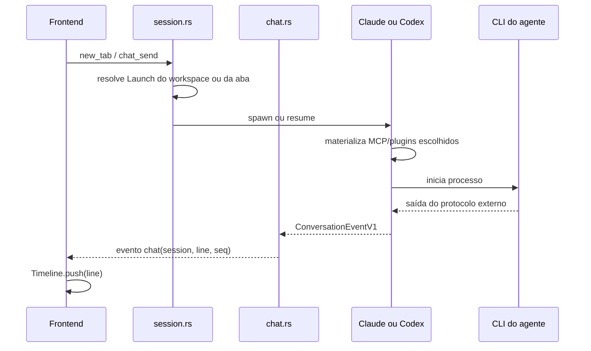

# Fluxo de conversa

Status: arquitetura atual.

## Conceito central

Uma aba representa uma sessão lógica. A identidade e o transcript sobrevivem
ao processo que executa o agente. Fechar, arquivar ou perder o processo não
apaga a conversa; a próxima fala pode retomá-la.

## Início e retomada

`Launch` reúne agente, modelo, esforço, plan mode, MCP e plugins. Uma aba pode
sobrescrever agente/modelo/esforço do workspace; MCP e plugins continuam sendo
escolhas do workspace.

Materialização pertence à borda. Claude recebe MCP e plugins por seus arquivos
e flags; Codex recebe a tabela MCP por override e plugins por um marketplace
derivado dentro de um `CODEX_HOME` de configuração isolado por workspace. Conta,
sessões e cache continuam compartilhados com o home real, sem escrever a
seleção no `config.toml` global. Se uma seleção explícita não puder ser
preparada, ou se os hooks declarados de um plugin não puderem ser ativados antes
do `SessionStart`, a conversa não abre silenciosamente sem ela. O fluxo completo
do marketplace está em
[`plugin-marketplace.md`](../contracts/plugin-marketplace.md).

Trocar modelo dentro do mesmo CLI derruba o processo e preserva a sessão.
Trocar de Claude para Codex ou vice-versa exige outra aba, pois seus mecanismos
de resume não compartilham identidade.

## Saída do agente

### Claude

`claude.rs` inicia `claude -p`, converte `ConversationCommandV1` para sua
entrada `stream-json` e normaliza cada linha de saída em
`ConversationEventV1`. O processo também grava o transcript nativo do Claude
Code, que o leitor de compatibilidade adapta durante replay.

### Codex

`codex.rs` inicia `codex app-server`, conversa por JSON-RPC e converte cada
resposta, pedido ou notificação diretamente em `ConversationEventV1`. No
sentido inverso, ele recebe `ConversationCommandV1` e monta o pedido JSON-RPC
correspondente sem passar pelo formato stream-json do Claude. O Prometeu
grava os eventos V1 em seu próprio transcript.

### Caminho comum

`Pump.feed` valida que a linha é JSON, decide se deve persistir, atribui uma
sequência de transporte e emite o evento Tauri `chat`. A sequência permite
juntar snapshot e atualizações ao vivo sem repetir nem perder linhas.

O reducer `Timeline` transforma eventos V1 em itens de usuário, mensagens do
assistente, blocos de ferramenta, pedidos, resultados, contexto e avisos. Ele é
puro: não acessa DOM, Tauri, disco, rede ou protocolos de provider. Linhas
legadas passam por `conversation-legacy.ts` antes do reducer.

## Entrada e controle

Uma fala local passa por `chat_send`. Se o processo estiver pronto, ela é
enviada imediatamente; caso contrário, fica em `pending_prompt` e o processo é
retomado. A fala entra no buffer antes dos eventos que ela provocar.

Interrupções e respostas a perguntas ou permissões usam
`ConversationCommandV1` e passam por `chat_control`.
Controle remoto usa `chat_control_remote`, que reconstrói a resposta a partir
do pedido existente no buffer. Um cliente remoto não pode trocar silenciosamente
o comando ou o input que o dono viu.

## Snapshot e compartilhamento

`chat_snapshot` devolve `{ text, seq }` sob o mesmo lock usado para numerar a
saída ao vivo. O colega desenha o snapshot até `seq` e descarta eventos ao vivo
com sequência já incluída nele.

O frontend do dono envia a conversa ao relay apenas enquanto alguém a observa.
O relay não executa comandos no worktree: encaminha falas e controles ao app do
dono, que valida e escreve no processo local.

## Ownership do estado

| Estado | Dono | Observação |
| --- | --- | --- |
| workspaces, abas e escolha de agente | `state.rs` | persistido em `board.json` |
| processo e buffer em memória | `chat.rs` | descartável |
| thread JSON-RPC do Codex | `codex.rs` + `Tab.agent_session` | necessária para resume |
| itens desenhados | `timeline.ts` | derivados do transcript |
| DOM da conversa | `chat.ts` | apresentação |
| sequência de transporte | `chat.rs` | não é identidade persistida do evento |
| presença e audiência | relay | estado de colaboração |

## Compatibilidade

O [`ADR 0002`](../decisions/0002-canonical-conversation-protocol.md) define o
contrato vigente em
[`conversation-events-v1.md`](../contracts/conversation-events-v1.md).
Transcripts antigos não são reescritos. Para o log do Codex, eventos novos
recebem um espelho legado ignorado pela versão atual, preservando rollback para
uma versão anterior do app.
